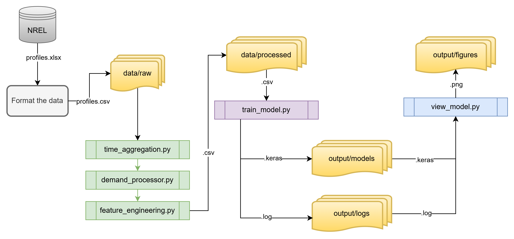

# Previsão de Carga Residencial com Veículos Elétricos usando Redes Neurais Artificiais

Este repositório contém o código-fonte e a implementação técnica do Trabalho de Graduação intitulado "**Previsão de carga residencial incluindo carregamento de veículos elétricos usando Redes Neurais Artificiais**".

> [Trabalho disponível nesse aqui](https://repositorio.unesp.br/entities/publication/2f5b6bec-c2f8-48a2-bd8e-65e620b411f4)

O objetivo deste projeto é desenvolver e avaliar um modelo de Redes Neurais Artificiais (ANN) capaz de prever a demanda de energia elétrica residencial, considerando o impacto crescente do carregamento de veículos elétricos (PEV).

## Visão Geral do Projeto

A previsão precisa da demanda de energia é fundamental para a operação eficiente da rede elétrica. A introdução de cargas de veículos elétricos (PEV) adiciona um novo nível de variabilidade e complexidade. Este projeto utiliza uma abordagem de *deep learning* (ANN) para modelar e prever a demanda agregada em cenários com e sem carregamento de PEV (Nível 1 e Nível 2).

## Estrutura do Repositório

O projeto segue uma estrutura modular para facilitar a reprodutibilidade e manutenção:

-   **/src**: Contém todo o código-fonte principal.
    -   **/src/preprocessing**: Scripts para limpeza, transformação, agregação e engenharia de atributos (feature engineering) dos dados.
    -   **/src/models**: Script para construir, treinar e avaliar os modelos de Rede Neural Artificial (ANN) usando TensorFlow/Keras.
    -   **/src/visualization**: Scripts para gerar os gráficos de resultados, como curvas de aprendizado e comparação entre valores reais e previstos.
-   **/data**: Pasta para armazenar os dados.
    -   **/data/raw**: `Dados originais e brutos da NREL entram aqui`.
    -   **/data/processed**: Dados intermediários processados e prontos para o treinamento do modelo.
<!-- -   `main.py`: O script principal (orquestrador) que executa o pipeline completo: pré-processamento, treinamento e visualização. -->
-   `requirements`: Lista de todas as dependências Python necessárias para rodar o projeto.

## Como Executar o Projeto

Para replicar os resultados e executar o pipeline de análise, siga os passos abaixo.

<!-- ### 0. Pré-processamento -->


### 1. Pré-requisitos

-   Python 3.9+
-   Git

### 2. Instalação

Primeiro, clone o repositório para sua máquina local:

```bash
git clone [https://github.com/arigideon/nre-data-analysis.git](https://github.com/arigideon/nre-data-analysis.git)

cd nre-data-analysis
```
É altamente recomendável criar um ambiente virtual (venv) para isolar as dependências do projeto:

```bash
python -m venv .venv

source .venv/bin/activate  # No Windows, use: .\.venv\Scripts\activate
```

Instale todas as bibliotecas necessárias:

```bash
pip install -r requirements
```

### 3. Fonte dos dados e formatação

Os dados processados não são versionados neste repositório, conforme as boas práticas. Os dados brutos utilizados neste estudo são os perfis de consumo conduzido pela `U.S. Energy Information Administration (EIA)`, e em informações disponibilizadas pelo National Renewable Energy Laboratory (NREL). 

Para executar o projeto, você precisa:

* 1. `Obter os dados originais`: Disponível publicamente no repositório do **NREL** [deste link](https://data.nrel.gov/submissions/69)

* 2. `Pré-processamento manual`: Os dados originais estão em `.xlsx` e devem ser convertidos para `.csv` seguindo a seguinte estrutura para cada um dos perfis da fonte original:

### `Residential-Profiles.csv`

| Time | Household 1 | Household 2 | Household 3 | (...) |
| --- | --- | --- | --- | --- |
| \<date> | \<int> | \<int> | \<int> | (...) |
| \<date> | \<int> | \<int> | \<int> | (...) |
| (...)   | (...)  | (...)  | (...)  | (...) |

### `PEV-Profiles-L1.csv`

| Time | Household 1(Vehicle 1) | Household 2(Vehicle 2) | Household 2(Vehicle 3) | (...) |
| --- | --- | --- | --- | --- |
| \<date> | \<int> | \<int> | \<int> | (...) |
| \<date> | \<int> | \<int> | \<int> | (...) |
| (...)   | (...)  | (...)  | (...)  | (...) |

### `PEV-Profiles-L2.csv`

| Time | Household 1(Vehicle 1) | Household 2(Vehicle 2) | Household 2(Vehicle 3) | (...) |
| --- | --- | --- | --- | --- |
| \<date> | \<int> | \<int> | \<int> | (...) |
| \<date> | \<int> | \<int> | \<int> | (...) |
| (...)   | (...)  | (...)  | (...)  | (...) |

* 3. `Coloca-los em /data/raw/`: Seguindo o pré-processamento manual descrito acima.

### 4. Executando o Pipeline

* 1. `time_aggregation.py`: Realiza agregações temporais nos dados de demanda.

* 2. `demand_processor.py`: Divide em diferentes cenários de carga (Re, Re+L1, etc).

* 3. `feature_engineering.py`: Cria as features (variáveis de entrada) para a rede neural.

* 4. `train_model.py`: Executa o processo de treinamento.

* 5. `view_model.py`: Carrega o histórico de treinamento salvo pelo **train_model.py** e plota os gráficos.

